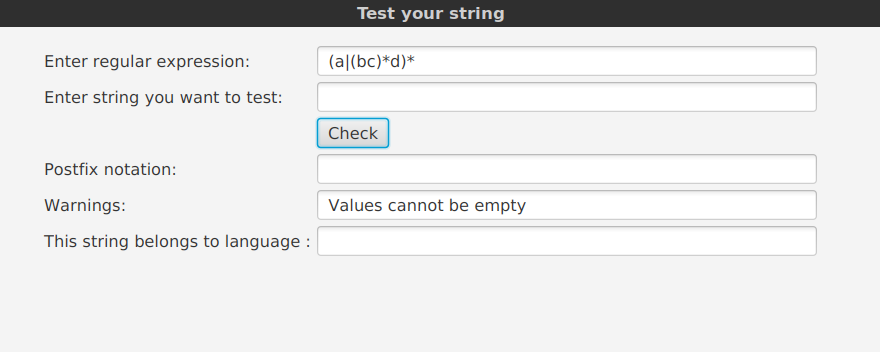
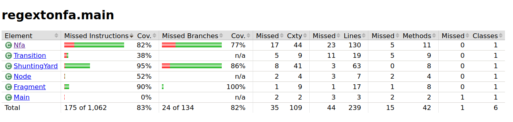

## Testing report ##

Three classes in the application are helper objects for constructing non-deterministic automata. A user
cannot directly manipulate classes Node, Transition and Fragment but their parameters are determined by
the regular expression the user enters.

Unit testing is implemented with JUnit. Nfa.java is the most important class of the application but for
efficiency reasons it does not have many separate methods. It does, however, have several global variables
and the accuracy of methods is tested by checking values of these variables.

ShuntingYard.java class is responsible for checking the user input. The app supports regular expressions with
letters and digits, and most characters. Characters \# and @ are reserved for building and simulating the 
automaton so they will give user a warning about illegal characters. User can enter their regex with or without
concatenation symbols. The app will check for the need for concatenation and add symbol '.' in between characters
or blocks of characters to be concatenated.

Spaces are eliminated from the regular expression input. In case of empty input, user gets a warning and the app won't
proceed.



User interface is excluded from automatic tests. 

The release jar has been tested by downloading it from Github and running it. The jar and application have only been
tested on an Ubuntu 18.04 device and Java 11. 

Run the tests from command line:
```
mvn test
```

Unit test coverage is checked with JaCoCo. Run the report form command line:
```
mvn jacoco:report
```



Code style is checked with Checkstyle. Run Checkstyle report:
```
mvn checkstyle:checkstyle
```
However, errors that are irrelevant for the readibility of the code have been 
ignored.
