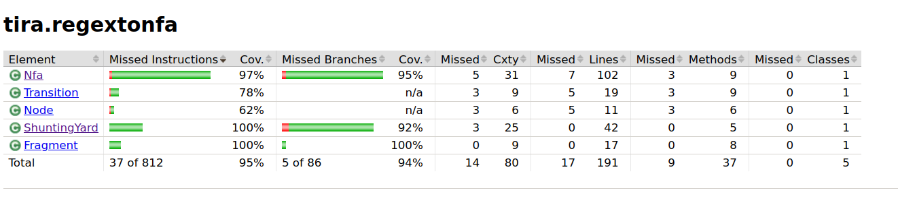

## Testing report ##


Three classes in the application are helper objects for constructing non-deterministic automata. A user
cannot directly manipulate classes Node, Transition and Fragment but their parameters are determined by
the regular expression the user enters.

Nfa.java is the most important class of the application but for efficiency reasons it does not have many
separate methods. It does, however, have several global variables and the accuracy of methods is tested
by checking values of these variables.

ShuntingYard.java class is responsible for checking the user input and there are several things to consider.
Currently the app accepts any sign as a character but that might change. User can enter their regex with or
without concatenation symbol. The app will check for the need for concatenation and add symbol '.' in between
characters or blocks of characters to be concatenated. However,this method is not fully tested yet so in case
of errors, the contructNfa() method of Nfa.java class  will also check if it ends up with separate Nfa fragments.
That means something is wrong with concatenation and a warning will be displayed.

Spaces are eliminated from the regular expression input. In case of empty input, user gets a warning and the app won't
proceed.

User interface is excluded from automatic tests. 

So far, the application has not been tested on any other than a Linux device. Because of JavaFx components
it has a separate main class for generating a runnable JAR file.

Unit test coverage is checked with JaCoCo. Run the report form command line:
```
mvn jacoco:report
```


