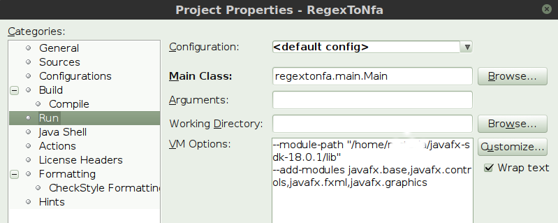
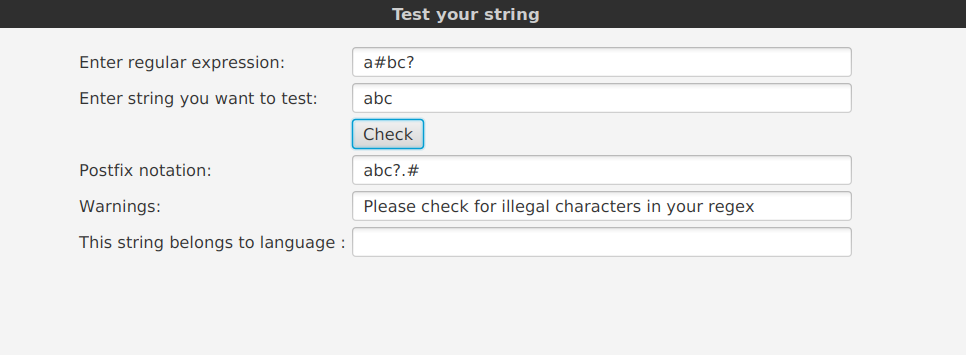

## User Manual ##

RegexToNfa application has a graphic user interface that requires you have JavaFx components installed
and the installation path added to VM options. For example, in Netbeans:



On command line:

```
--module-path /your path/javafx-sdk-18.0.1/lib --add-modules javafx.controls,javafx.fxml
```
Run the app from command line:

```
mvn exec:java -Dexec.mainClass=regextonfa.main.Main
```
Generate Javadoc:
```
mvn javadoc:javadoc
```
Generate jar:
```
mvn package
``` 
If you download the Jar from Github, you may cd to the folder and run it:
```
java -jar RegexToNfa-1.0.jar
```

### General use ###

The application supports regular expressions consisting of letters, digits and most other characters. It
is case-sensitive, so *A* will not match *a*. The supported operations are  | for alternation, . for concatenation,
\* for closure (zero or more) and \+ for one or more. It does not (yet) support operation ? (zero or one). These
symbols can only be used as operators. Other characters that cannot be used as part of regex are \# and @, which
are reserved for other purposes in the source code. Unsupported characters will produce an error:



In this application alternation has precedence over concatenation. For example, aba|baba* means that *a* and
*b* in the middle of string are alternated. Use parentheses if you want to alternate concatenated characters, for
example (aba)|(baba)* or (m|(ad))agio.

The application is not guaranteed to run on other than Ubuntu devices or with older versions Java.

